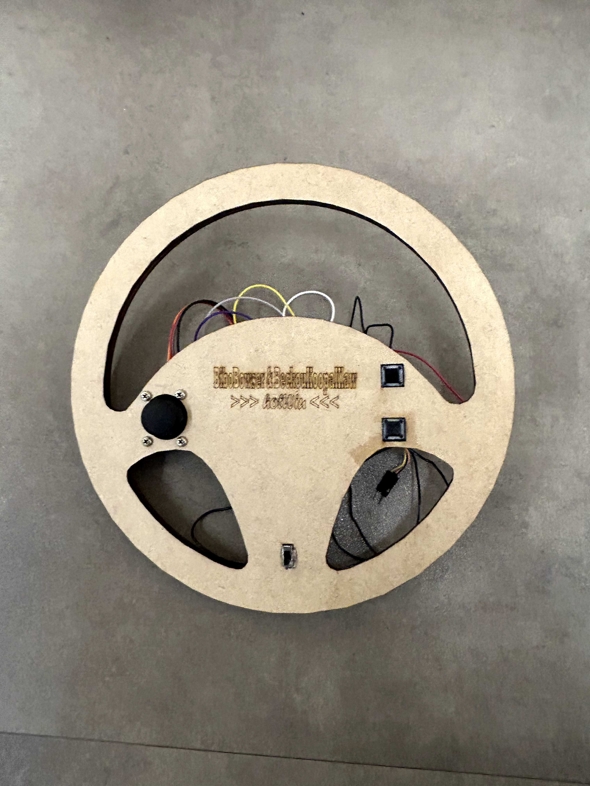

# ReadMe - Aps 2 Embarcados 24a
# Controle Mario Kard (Online PC Game)
Por: Beatriz Borges e Maria Vitória Sartori

Link do Jogo
-----
https://mkpc.malahieude.net/ 
O controle só funciona rodando no sistema operacional Linux

Vídeo Demonstração
-----
link do vídeo ou o próprio vídeo

Como Usar o Controle *"BiboBowser & BeckouKoopaKlaw HotWiu"*
-----



Os comandos para jogar o jogo adequadamente e os seus respectivos botões no controle são:


| Comando | Botão no Controle | Uso no Jogo |
| ------------- | ------------- |------------- |
| Key Up | Joystick up  | Acelerar |
| Key Down  | Joystick down  | Ré  |
| Key Left  | Girar controle para Esquerda | Esquerda |
| Key Right  | Girar controle para Direita| Direita|
| Space | Botão Superior da Direita | Jogar poder do carro |
| Enter  | Botão  Inferior da Direita  | Selecionar fase, personagens, etc|

Diagrama de Blocos Explicativo do Firmware
----- 


**Requisitos Desenvolvidos**
- (meio conceito) Utiliza ADC e IMU juntos no jogo
- (meio conceito) O jogo deve ser "jogável" com o controle (sem latência, e avalido pela equipe)
- (meio conceito) Envia com a entrega vídeo TOP/ stonks do controle nível quickstarter
- (meio conceito) Código separado em .c e .h
- (meio conceito) Utiliza algum componente não visto em sala de aula - vibrador
- (meio conceito) Hardware integrado no controle (bateria e tudo mais) 

# HC06 exemplo

Conectar HC06 no 5V e gnd, pino TX no `GP5` e pino RX no `GP4`. Também é necessário conectar o pino `STATE` do bluetooth no pino `GP3`.

O projeto está organizado da seguinte maneira:

- `hc06.h`: Arquivo de headfile com configurações do HC06, tais como pinos, uart, ..
- `hc06.c`: Arquivo `.c` com implementação das funções auxiliares para configurar o módulo bluetooth
    - `bool hc06_check_connection();`
    - `bool hc06_set_name(char name[]);`
    - `bool hc06_set_pin(char pin[]);`
    - `bool hc06_set_at_mode(int on);`
    - `bool hc06_init(char name[], char pin[]);`

- `main.c` Arquivo principal com inicialização do módulo bluetooth

```c
void hc06_task(void *p) {
    uart_init(HC06_UART_ID, HC06_BAUD_RATE);
    gpio_set_function(HC06_TX_PIN, GPIO_FUNC_UART);
    gpio_set_function(HC06_RX_PIN, GPIO_FUNC_UART);
    hc06_init("aps2_legal", "1234");

    while (true) {
        uart_puts(HC06_UART_ID, "OLAAA ");
        vTaskDelay(pdMS_TO_TICKS(100));
    }
}
```

Extra ao que foi feito em sala de aula, eu adicionei o `hc06_set_at_mode` que força o módulo bluetooth entrar em modo `AT`, caso contrário ele fica 
conectado no equipamento e não recebe mais comandos.

## No linux

Para conectar o bluetooth no linux usar os passos descritos no site:

- https://marcqueiroz.wordpress.com/aventuras-com-arduino/configurando-hc-06-bluetooth-module-device-no-ubuntu-12-04/


BOTOẼS

- Acelerador - up
- marcha ré - down
- Poder - space
- next race / quit / escolher personagem - botaozinho de ir p cima baixo/lado e outro
- acelerômetro 


 